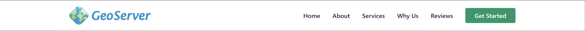
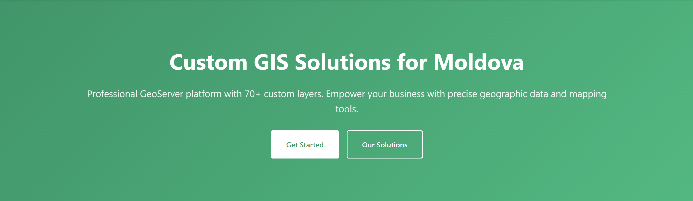
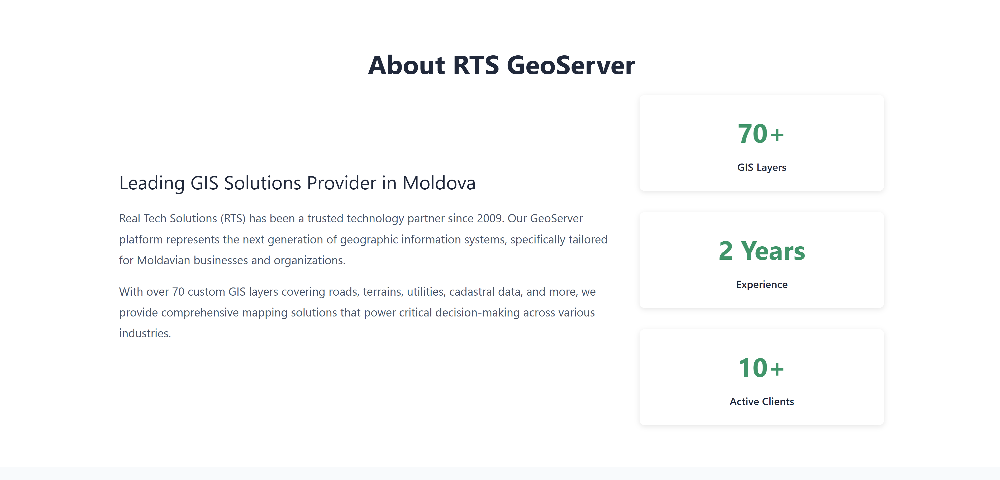
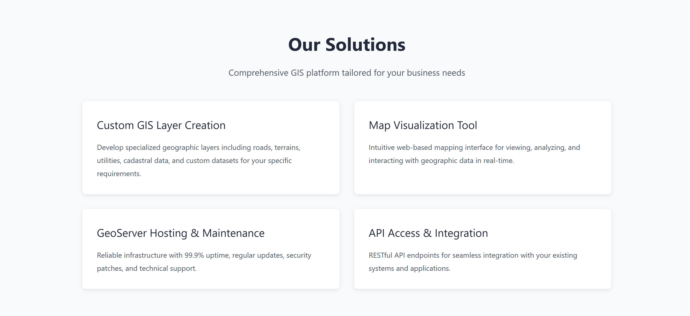
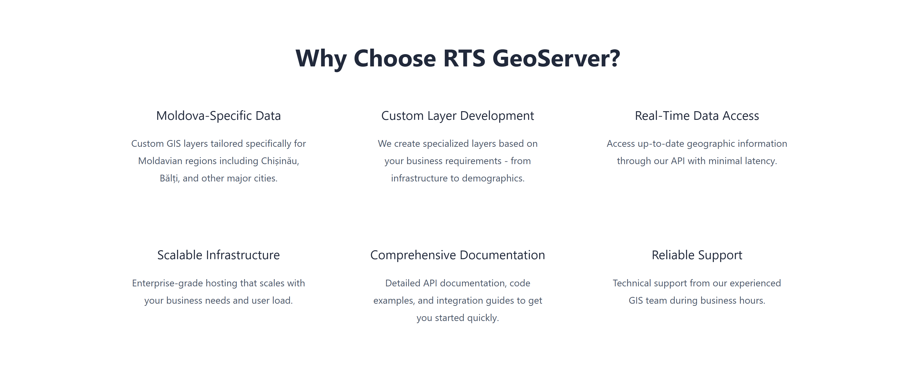
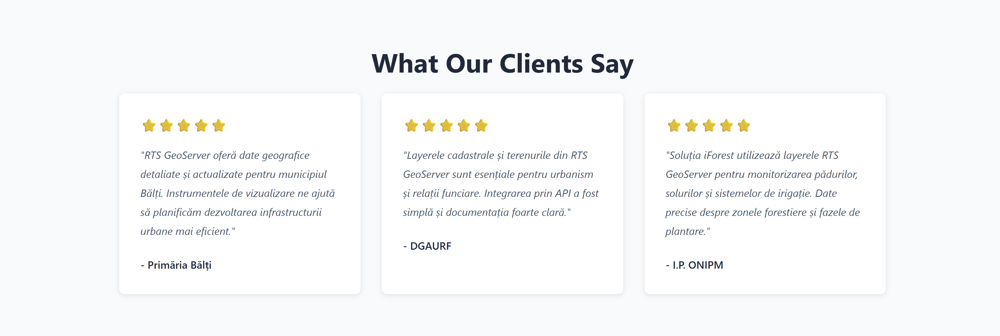
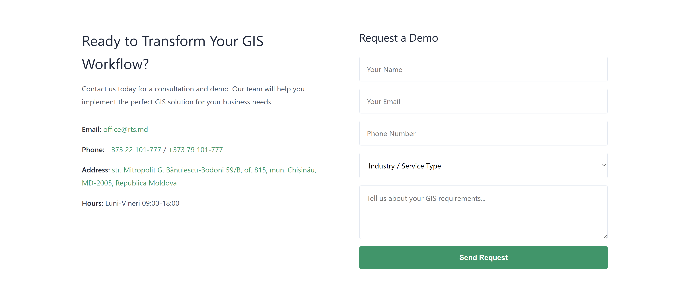
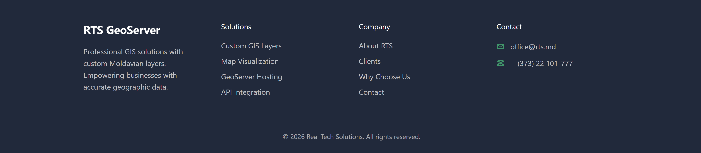

# RTS GeoServer Landing Page

**Course:** Web Development  
**Author:** Alexandru Rudoi

Professional landing page for Real Tech Solutions GeoServer - a custom GIS platform designed specifically for Moldovan businesses and organizations. The platform provides 70+ custom geographic layers including roads, terrains, utilities, cadastral data, and comprehensive mapping solutions.

## Live Demo

[View Live Site](https://alexandrurudoi.github.io/tum-web-lab2/)

## Project Overview

RTS GeoServer is a specialized Geographic Information System solution that serves government agencies, real estate companies, agricultural organizations, and logistics providers across Moldova. This landing page showcases the platform's capabilities, features, and client testimonials.

## Screenshots

### Navigation

### Hero Section

### About Section

### Services Section

### Benefits Section

### Testimonials Section

### Contact Section

### Footer

## Technologies Used

- HTML5 (Semantic markup)
- CSS3 (Custom properties, Flexbox, Grid)
- Git & GitHub (Version control with feature branching)
- GitHub Pages (Deployment)

## Features

- Sticky navigation with fixed positioning
- Hero section with gradient background
- Statistics showcase (70+ layers, 2 years experience, 10+ clients)
- Four main service offerings presented in card layout
- Six key benefits in grid layout
- Real client testimonials from Primaria Balti, DGAURF, and ONIPM
- Interactive contact form with industry selection
- Multi-column footer with solution links and contact information
- Green-themed color scheme matching GeoServer branding
- Clickable contact details (mailto, tel, maps links)

## Development Process

The project was developed using Git feature branching workflow:
- Each major section was developed on a separate feature branch
- Content updates committed systematically per section
- Styling refined with separate commits
- Clean commit history following conventional commit messages

## Requirements Compliance

- Navigation with section links and CTA button
- Multiple call-to-action buttons (Get Started, Our Solutions, Request Demo)
- 7 main sections (Navigation, Hero, About, Services, Benefits, Testimonials, Contact, Footer)
- Professional design with green gradient hero and clean layouts
- Vanilla HTML5 and CSS3 (no frameworks)
- Comprehensive Git history with feature branches and descriptive commits
- Deployed on GitHub Pages
- README with project description, screenshots, and live demo link

